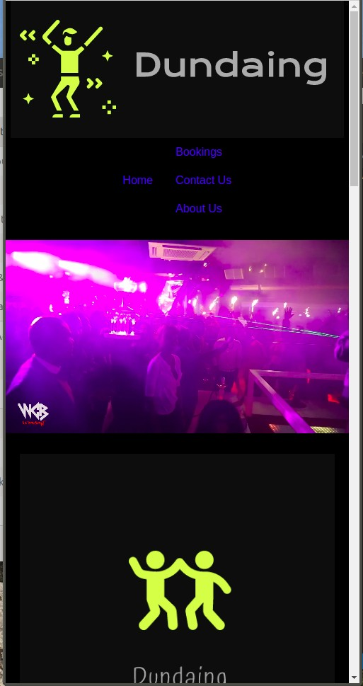

# DUNDAING

## Description
A web application that allows users' to recreate the night club atmosphere at the comfort of your home and an option to also choose if they need a venue to go party.

## Screenshot

### Technologies Used
<ol>
<li>HTML</li>
<li>CSS</li>
<li>JavaScript</li>
<li>PicsArt</li>
<li>Firebase</li>
</ol>

### Set-up Instructions.
<ul>
<li>Clone the repository to a loaction in your file at https://github.com/mukhtarabdirahman/Dundaing.git </li>
<li>Open the folder you have cloned</li>
<li>Open <ins>index.html</ins> on your browser.</li>
</ul>

### Behaviour Driven Development
<ol type="I">
<li>Displays form options for customizing to cart.</li>
<ul>
<li>INPUT: User selects the bouncer they want</li>
<li>INPUT: User selects the type of drinks they want</li>
<li>INPUT: User selects whether they want food</li>
<li>INPUT: User selects wether they want a system</li>
<li>OUTPUT: Displays User's order and proceed to checkout where they pay and get their full order summary</li>
</ul>
<li>Displays form for contact us</li>
<ul>
<li>INPUT: The user writes their message</li>
<li>OUTPUT: Displays feedback message upon recieving</li>
</ul>
</ol>

### Known Bugs
If you find a bug,kindly open an issue here by including your search query and the expected result.
To fix a bug:
<ul list-style-type=circle;>
<li>Fork the repository</li>
<li>Open your terminal</li>
<li>Create a new branch</li>
<li>Make the changes, then (git add) to add changes</li>
<li>Commit the changes you have made(git commit -m"Fixed bug") </li>
<li>Push changes made and Create a  pull request.</li>

### Contact Information
> To get in touch you can:
<li>E-mail us @info.dundaing.com</li>
<li>Tag us on Instagram at <ins>@Dundaing<ins> </li>
